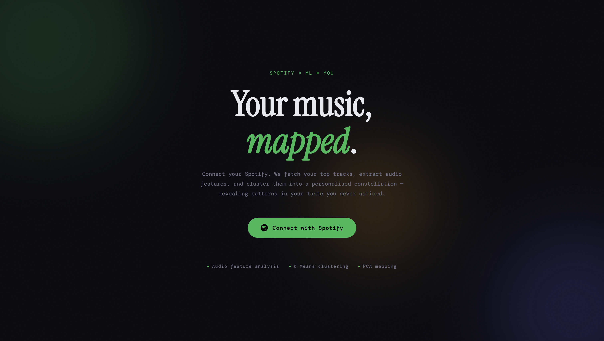
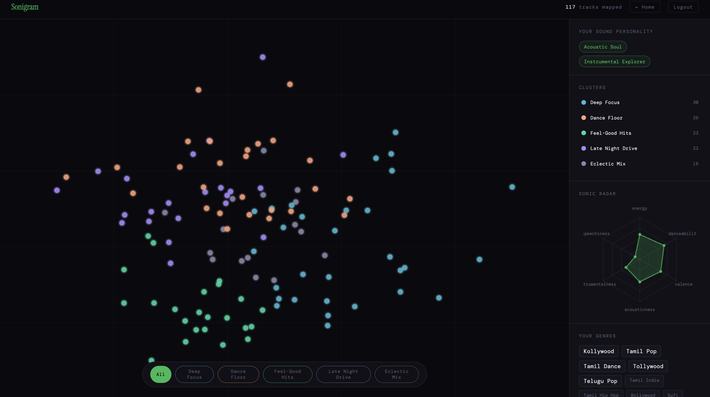
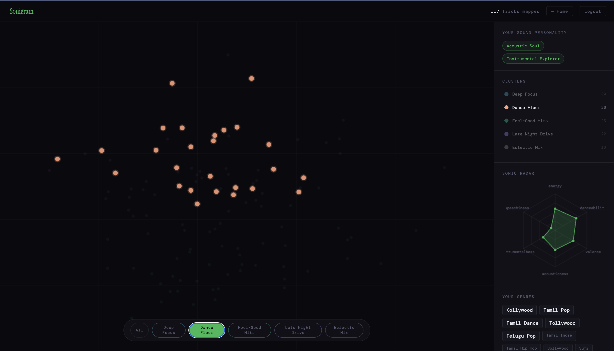
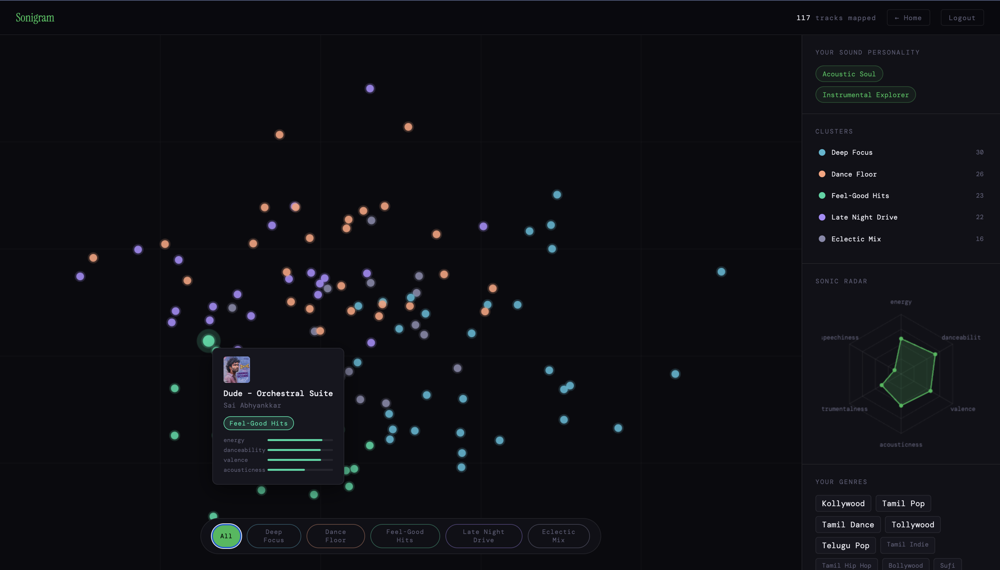

# 🎵 Sonigram

> *Your music taste, mapped like a fingerprint.*


Sonigram connects to your Spotify account, pulls your top tracks across three time horizons, extracts audio features per track, and runs a full ML pipeline — **MinMaxScaler → PCA → K-Means** — to cluster your music and plot it on a beautiful interactive 2D constellation map.

The result: a personal "sonic fingerprint" that reveals patterns in your taste you never consciously noticed — with dynamically labelled clusters like *Dance Floor*, *Acoustic Soul*, or *Emotional Journey* based on the actual audio characteristics of your music.

---

## ✨ Features

- **Spotify OAuth 2.0** — secure login, no passwords stored
- **150-track dataset** — pulls top tracks from short, medium, and long-term listening history
- **Audio feature extraction** — 9 dimensions per track (energy, tempo, valence, speechiness, and more)
- **ML pipeline** — MinMaxScaler normalisation, PCA dimensionality reduction, K-Means clustering
- **Dynamic cluster labels** — computed from each cluster's centroid, not hardcoded
- **Interactive constellation map** — hover any dot to see track info, album art, and a mini feature bar chart
- **Cluster filtering** — click any cluster to isolate it on the map; others fade away
- **Sonic radar** — a hexagonal radar chart of your personal audio fingerprint
- **Genre cloud** — extracted from your top artists
- **Sound personality** — auto-generated trait labels (e.g. "High Energy", "Acoustic Soul", "Dance Lover")

---

## 🖼️ Screenshots






---

## 🏗️ Architecture


## 🚀 Getting Started

### Prerequisites

- Python 3.10+
- A [Spotify Developer account](https://developer.spotify.com/dashboard)

### 1. Clone the repository

```bash
git clone https://github.com/yourusername/sonigram.git
cd sonigram
```

### 2. Install dependencies

```bash
pip install -r requirements.txt
```

### 3. Set up Spotify credentials

1. Go to [Spotify Developer Dashboard](https://developer.spotify.com/dashboard)
2. Create a new app
3. Add `http://127.0.0.1:5000/callback` as a **Redirect URI** in the app settings
4. Copy your **Client ID** and **Client Secret**

```bash
cp .env.example .env
# Edit .env with your credentials
```

```env
SPOTIFY_CLIENT_ID=your_client_id
SPOTIFY_CLIENT_SECRET=your_client_secret
SPOTIFY_REDIRECT_URI=http://127.0.0.1:5000/callback
FLASK_SECRET_KEY=any-random-string
```

### 4. Run

```bash
python app.py
```

Open [http://127.0.0.1:5000](http://127.0.0.1:5000) and connect your Spotify account.

---

## 🧠 How the ML Pipeline Works

### 1. Data Collection
Top tracks are requested from three Spotify time ranges (`short_term`, `medium_term`, `long_term`), deduplicated into a dataset of up to 150 unique tracks.

### 2. Feature Extraction
For each track, Spotify's audio features endpoint returns 9 continuous features:

| Feature | Description |
|---|---|
| `danceability` | How suitable for dancing (rhythm, beat strength) |
| `energy` | Perceptual intensity and activity |
| `loudness` | Overall loudness in dB |
| `speechiness` | Presence of spoken words |
| `acousticness` | Confidence the track is acoustic |
| `instrumentalness` | Predicts whether a track has no vocals |
| `liveness` | Presence of a live audience |
| `valence` | Musical positiveness / happiness |
| `tempo` | Estimated BPM |

### 3. ML Pipeline

```python
MinMaxScaler()         # normalise all features to 0–1 (prevents loudness/tempo dominating)
→ PCA(n_components=2)  # reduce to 2D for visualisation, preserving max variance
→ KMeans(n_clusters=5) # assign each track to a sonic cluster
```

### 4. Dynamic Cluster Labelling
Rather than hardcoding names, each cluster is labelled by analysing its **centroid** — the average feature values of all tracks in that group. Rules like these determine the label:

| Condition | Label |
|---|---|
| `danceability > 0.65` AND `energy > 0.55` | Dance Floor |
| `energy > 0.65` AND `valence > 0.45` | Energetic Anthems |
| `acousticness > 0.55` | Acoustic Soul |
| `instrumentalness > 0.25` | Deep Focus |
| `valence < 0.35` AND `energy > 0.55` | Sad Bangers |
| `energy < 0.45` | Chill Vibes |

No two clusters share a label — larger clusters get first pick, and a chain of unique catch-alls ensures every cluster always gets a distinct, meaningful name.

---

## 📁 Project Structure

```
sonigram/
├── app.py              # Flask routes & session management
├── spotify_client.py   # Spotify API wrapper (OAuth + data fetching)
├── pipeline.py         # ML pipeline (scaling, PCA, K-Means, dynamic labelling)
├── templates/
│   ├── index.html      # Landing page
│   └── visualize.html  # Interactive constellation map (Canvas API)
├── requirements.txt
├── .env.example
└── .gitignore
```
